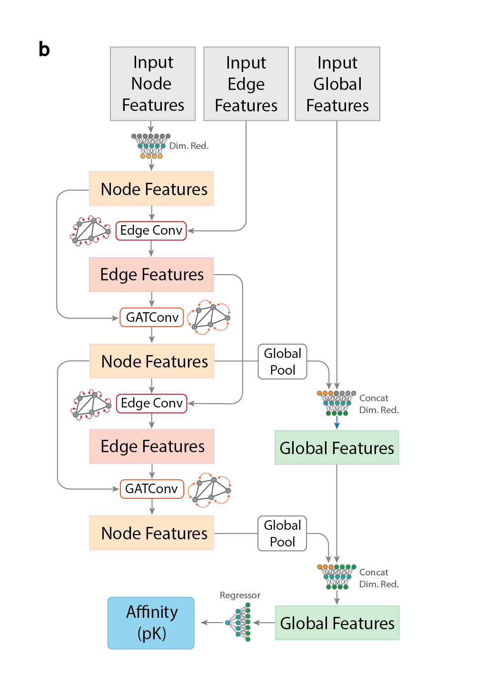

# GEMS18 Model Architecture

## Overview

GEMS is a Graph Neural Network (GNN) architecture designed protein-ligand binding affinity prediction. This document explains the main components of architecture and describes how information in the graphs is transformed into a final scalar output.

## Architecture Components

### 1. Feature Transformation (FeatureTransformMLP)
The first step in the pipeline is transforming the input node features using a Multi-Layer Perceptron (MLP):
- Input features → Hidden layer (256 units) → Output layer (64 units)
- Uses ReLU activation and dropout for regularization
- This initial transformation prepares the node features for the GNN layers

### 2. Graph Neural Network Components
The model contains **two stacked main GNN layers**, each composed of three sub-components:

#### a) Edge Model
- Updates edge features based on:
  - Source node features
  - Destination node features
  - Current edge features
- Uses an MLP with the following structure:
  - Concatenates source node, destination node, and edge features
  - Transforms through hidden layer
  - Produces updated edge features

#### b) Node Model
- Implements Graph Attention Network (GATv2) for node feature updates
- Key features:
  - 4 attention heads
  - Processes both node and edge features
  - Aggregates information from neighboring nodes
  - Uses attention mechanism to weight different node contributions

#### c) Global Model
- Aggregates information across the entire graph
- Components:
  - Global pooling of node features
  - Concatenation with current global features
  - MLP transformation
  - Updates global graph representation

### 3. Final Prediction Layer
The model concludes with fully connected layers:
- Global features (256) → Hidden layer (64) → Output (1)
- Uses ReLU activation
- Dropout for regularization

## Key Features

1. **Batch Normalization**
   - Applied after the first GNN layer
   - Normalizes node features, edge features, and global features
   - Helps with training stability

2. **Dropout**
   - Used throughout the network
   - Helps prevent overfitting
   - Applied to both feature transformations and fully connected layers

3. **Attention Mechanism**
   - Uses GATv2Conv for node updates
   - 4 attention heads for better feature extraction
   - Allows the model to focus on important node relationships

4. **Residual Connections**
   - Optional skip connections in edge and node models
   - Helps with gradient flow
   - Can be enabled/disabled based on task requirements

## Implementation Details

The model is implemented using PyTorch and PyTorch Geometric:
- Uses `torch_geometric.nn.MetaLayer` for structured GNN layers
- Implements message passing through edge and node models
- Utilizes `GATv2Conv` for attention-based node updates
- Global pooling through `global_add_pool` for graph-level features

## Model Parameters
- Input node features → transformed to 64 dimensions
- Edge features → processed in 32 dimensions
- Global features → maintained in 256 dimensions
- Final prediction → single output value

This architecture provides a balance between computational efficiency and model expressiveness, making it suitable for molecular analysis tasks while being practical for CPU-based training and inference.
